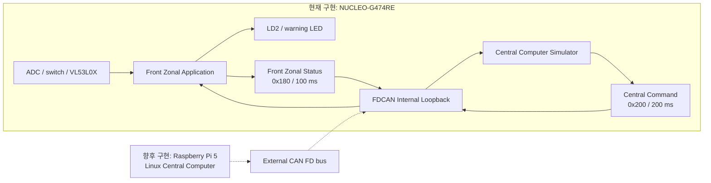

# Automotive Zonal ECU Prototype

Raspberry Pi 기반 Central Computer와 STM32 기반 Front Zonal ECU의 책임을 분리하고,
CAN FD로 연결하는 차량 E/E 아키텍처 축소 프로젝트입니다.

현재 저장소는 **NUCLEO-G474RE에서 검증한 STM32 superloop baseline**을 담고 있습니다.
Raspberry Pi와 외부 CAN FD 하드웨어는 다음 단계에서 통합합니다.

## Current milestone

`v0.1 — STM32 Front Zonal ECU superloop baseline`

현재 구현하고 보드에서 확인한 범위는 다음과 같습니다.

- STM32G474 170 MHz system clock
- ADC 기반 analog input과 0~1000 permille 변환
- 20 ms switch debounce
- VL53L0X 비동기 거리 측정 서비스
- CAN FD frame encode/decode와 payload validationa
- FDCAN internal loopback 및 interrupt 기반 RX
- 100 ms Front Zonal Status 전송
- Central Computer 임시 simulator의 200 ms command 전송
- command timeout 시 출력 차단과 `SAFE` 상태 전환
- 거리센서 오류 시 `DEGRADED` 상태 전환
- CAN sequence, payload, HAL TX, timeout 진단 카운터
- 하드웨어 비의존 모듈의 host unit test

## System concept



현재 Central Computer Simulator는 Raspberry Pi가 연결되기 전 ECU의 양방향 통신,
상태 전이, timeout 동작을 검증하기 위해 STM32 내부에서만 실행됩니다.

## Responsibility split

| Component | Responsibility |
|---|---|
| Central Computer | 상위 제어 정책, 명령 생성, 상태 수집, 로깅 및 진단 |
| Front Zonal ECU | 센서 및 스위치 입력, local output, 주기 상태 전송, timeout 기반 safe output |
| CAN contract | sender/receiver, CAN ID, payload, 주기, alive counter와 validity 규칙 정의 |

## Repository layout

```text
automotive-zonal-ecu/
├── README.md
├── .gitignore
├── docs/
│   ├── architecture.md
│   ├── requirements.md
│   ├── hardware-setup.md
│   ├── can-protocol.md
│   ├── verification.md
│   └── development-log.md
└── firmware/
    └── front-zonal-ecu/
        ├── App/          # 직접 설계한 application/service 코드
        ├── Inc/          # CubeMX 생성 header
        ├── Src/          # CubeMX 생성 코드와 main integration
        ├── Drivers/      # STM32 HAL, CMSIS, VL53L0X API
        ├── Startup/      # MCU startup assembly
        └── Tests/        # PC에서 실행하는 unit test
```

Raspberry Pi 구현을 시작하면 `central-computer/`와 필요한 Linux platform 파일을
실제 코드가 생기는 시점에 추가합니다.

## Firmware modules

| Module | Role |
|---|---|
| `can_protocol` | CAN payload encode/decode와 값 범위 검증 |
| `can_service` | FDCAN 초기화, 주기 송신, interrupt RX, 통신 진단 |
| `central_sim` | Raspberry Pi 연결 전 Central Computer 명령 생성 |
| `front_zonal_app` | ECU 상태 전이, 명령 timeout, 출력 정책 |
| `input_service` | ADC 변환, 입력 validity, switch debounce |
| `input_service_stm32` | HAL ADC/GPIO adapter |
| `distance_sensor_service` | VL53L0X 초기화와 non-blocking 측정 state machine |
| `time_utils` | interrupt와 tick rollover를 고려한 경과시간 계산 |

## Documentation

- [Architecture](docs/architecture.md)
- [Requirements](docs/requirements.md)
- [Hardware setup](docs/hardware-setup.md)
- [CAN protocol](docs/can-protocol.md)
- [Verification](docs/verification.md)
- [Development log](docs/development-log.md)

## Build

### STM32 firmware

1. STM32CubeIDE에서 `firmware/front-zonal-ecu`를 existing project로 import합니다.
2. `Debug` configuration을 선택합니다.
3. Project의 Clean/Build를 실행합니다.
4. ST-LINK로 NUCLEO-G474RE에 다운로드합니다.

현재 기준 전체 ARM build 결과는 `0 errors, 0 warnings`입니다.

### Host unit tests

`Tests/`의 테스트는 HAL에 의존하지 않는 모듈을 PC C compiler로 검증합니다.
현재 검증 대상은 CAN protocol, Central Simulator, Front Zonal Application,
Input Service, time utility입니다. 반복 실행용 test script와 CI는 후속 단계에서 추가합니다.

## Roadmap

- [x] STM32 peripheral and sensor bring-up
- [x] CAN FD internal loopback and interrupt RX
- [x] Protocol/service/application modularization
- [x] Host unit tests and board regression test
- [ ] FreeRTOS task architecture
- [ ] STM32 TJA1051T/3 external transceiver integration
- [ ] Raspberry Pi MCP2518FD and SocketCAN integration
- [ ] Real two-node CAN FD communication and fault tests
- [ ] Linux service lifecycle, logging and diagnostics
- [ ] Device Tree and Yocto image integration

## Engineering boundary

이 저장소는 automotive-style E/E architecture를 학습하고 검증하기 위한 prototype입니다.
AUTOSAR, ISO 26262, ASIL 또는 production-ready automotive ECU 준수를 주장하지 않습니다.
