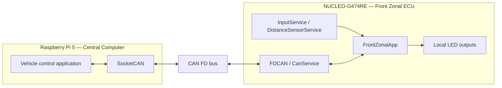
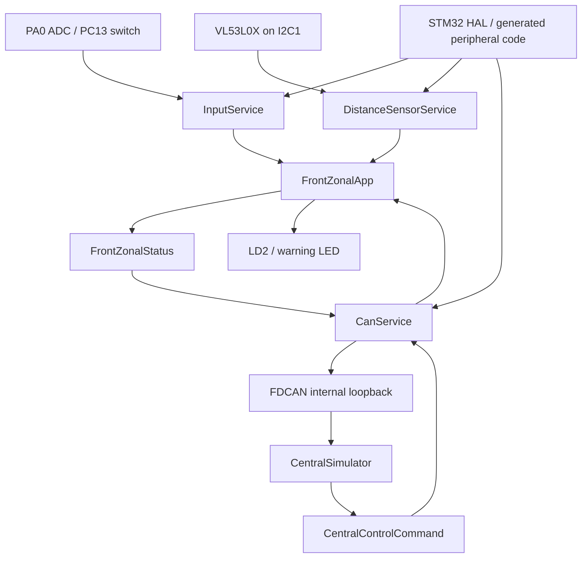
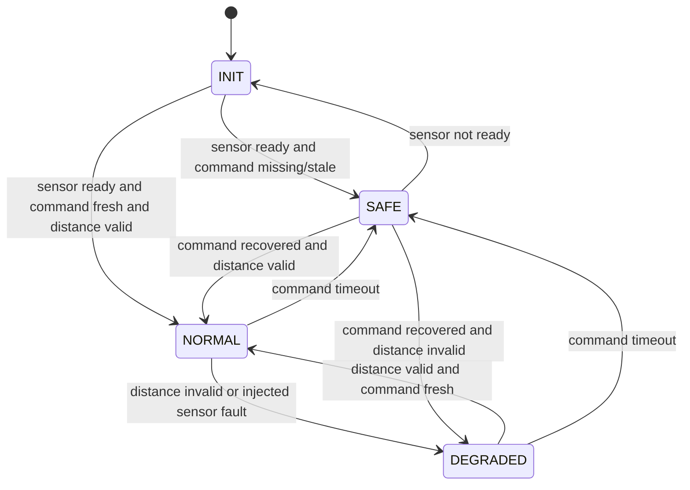

# System Architecture

## 1. Objective

프로젝트의 핵심은 Linux Central Computer가 상위 정책을 담당하고,
STM32 Front Zonal ECU가 local I/O와 timeout 기반 안전 출력을 담당하도록
책임을 분리하는 것입니다.

현재 단계에서는 외부 CAN 하드웨어가 도착하기 전이므로 Central Computer 역할을
STM32 내부 `CentralSimulator`가 대신합니다. 이 simulator는 최종 구성요소가 아니라
ECU의 status-command closed loop를 먼저 검증하기 위한 test double입니다.

## 2. Target architecture

## 3. Current STM32 baseline

## 4. Firmware boundaries

| Layer | Modules | Responsibility |
|---|---|---|
| Application policy | `front_zonal_app`, `central_sim` | ECU state, output policy, warning hysteresis, timeout reaction |
| Communication | `can_protocol`, `can_service` | Payload contract, FDCAN transfer, RX interrupt and diagnostics |
| Services | `input_service`, `distance_sensor_service` | Periodic input and sensor state machines |
| Platform adapter | `input_service_stm32`, VL53L0X platform | HAL calls and board-specific access |
| Generated/BSP | `Src`, `Inc`, `Drivers`, `Startup` | Clock, peripheral init, interrupts and vendor code |

`main.c`는 각 모듈을 연결하고 superloop에서 `Process` 함수를 호출합니다.
정책과 protocol 처리를 별도 모듈에 둬서 FreeRTOS로 전환하더라도 핵심 로직을
다시 작성하지 않는 구조를 목표로 합니다.

## 5. State model

출력은 Central Command가 유효한 동안만 적용하며, 500 ms command timeout에서는
두 command-controlled LED를 모두 끕니다.

## 6. Planned evolution

1. 현재 superloop baseline을 보존합니다.
2. FreeRTOS를 최소 task 구성으로 도입하고 기존 board regression을 반복합니다.
3. TJA1051T/3를 연결해 STM32를 external normal mode로 전환합니다.
4. Raspberry Pi에 MCP2518FD와 SocketCAN을 구성합니다.
5. 내부 `CentralSimulator`를 비활성화하고 실제 Linux command source로 대체합니다.
6. 물리 bus fault, timeout, recovery와 장시간 traffic을 검증합니다.

